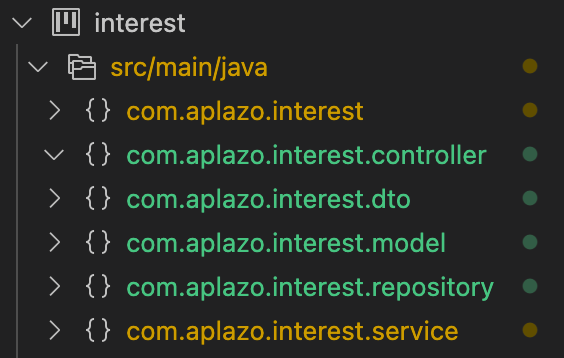

# Code Challenge: Simple Interest microservice

Create a microservice with spring-boot that calculate and generates the list of payments of the simple interest of a credit that must be paid in n terms and in 
weekly form:

Input

```JSON
{
    "amount": Double,
    "terms":Integer,
    "rate":Double
}
```

Output

```JSON
{
   [
      {
        "payment_number":Integer,
        "amount": Double,
        "payment_date":Date
       }
      …
   ]
}
```

# Discussing

For the solution that i've been implemented, i used the following architecture:



### Reasoning

The programming language chosen for this solution was java with spring boot because that was defined in the specification file .

## Execution

For the correct execution of the application we use the terminal and with the following command

```bash
docker run -p LOCAL_PORT:8080 aplazo-boot-docker.jar
```

For example:

```bash
$ docker run -p 1234:8080 aplazo-boot-docker.jar

  .   ____          _            __ _ _
 /\\ / ___'_ __ _ _(_)_ __  __ _ \ \ \ \
( ( )\___ | '_ | '_| | '_ \/ _` | \ \ \ \
 \\/  ___)| |_)| | | | | || (_| |  ) ) ) )
  '  |____| .__|_| |_|_| |_\__, | / / / /
 =========|_|==============|___/=/_/_/_/
 :: Spring Boot ::                (v2.6.6)

2022-04-07 16:01:32.179  INFO 1 --- [           main] com.aplazo.interest.InterestApplication  : Starting InterestApplication v0.0.1-SNAPSHOT using Java 17.0.2 on 7bf0cb95daf6 with PID 1 (/aplazo-boot-docker.jar started by root in /)
2022-04-07 16:01:32.181  INFO 1 --- [           main] com.aplazo.interest.InterestApplication  : No active profile set, falling back to 1 default profile: "default"
2022-04-07 16:01:33.103  INFO 1 --- [           main] .s.d.r.c.RepositoryConfigurationDelegate : Bootstrapping Spring Data JPA repositories in DEFAULT mode.
2022-04-07 16:01:33.180  INFO 1 --- [           main] .s.d.r.c.RepositoryConfigurationDelegate : Finished Spring Data repository scanning in 61 ms. Found 2 JPA repository interfaces.
2022-04-07 16:01:34.062  INFO 1 --- [           main] o.s.b.w.embedded.tomcat.TomcatWebServer  : Tomcat initialized with port(s): 8080 (http)
2022-04-07 16:01:34.075  INFO 1 --- [           main] o.apache.catalina.core.StandardService   : Starting service [Tomcat]
2022-04-07 16:01:34.075  INFO 1 --- [           main] org.apache.catalina.core.StandardEngine  : Starting Servlet engine: [Apache Tomcat/9.0.60]
2022-04-07 16:01:34.291  INFO 1 --- [           main] o.a.c.c.C.[Tomcat].[localhost].[/]       : Initializing Spring embedded WebApplicationContext
2022-04-07 16:01:34.291  INFO 1 --- [           main] w.s.c.ServletWebServerApplicationContext : Root WebApplicationContext: initialization completed in 2018 ms
2022-04-07 16:01:34.499  INFO 1 --- [           main] o.hibernate.jpa.internal.util.LogHelper  : HHH000204: Processing PersistenceUnitInfo [name: default]
2022-04-07 16:01:34.579  INFO 1 --- [           main] org.hibernate.Version                    : HHH000412: Hibernate ORM core version 5.6.7.Final
2022-04-07 16:01:34.824  INFO 1 --- [           main] o.hibernate.annotations.common.Version   : HCANN000001: Hibernate Commons Annotations {5.1.2.Final}
2022-04-07 16:01:34.951  INFO 1 --- [           main] com.zaxxer.hikari.HikariDataSource       : HikariPool-1 - Starting...
2022-04-07 16:01:35.204  INFO 1 --- [           main] com.zaxxer.hikari.HikariDataSource       : HikariPool-1 - Start completed.
2022-04-07 16:01:35.232  INFO 1 --- [           main] org.hibernate.dialect.Dialect            : HHH000400: Using dialect: org.hibernate.dialect.H2Dialect
2022-04-07 16:01:35.798  INFO 1 --- [           main] o.h.e.t.j.p.i.JtaPlatformInitiator       : HHH000490: Using JtaPlatform implementation: [org.hibernate.engine.transaction.jta.platform.internal.NoJtaPlatform]
2022-04-07 16:01:35.808  INFO 1 --- [           main] j.LocalContainerEntityManagerFactoryBean : Initialized JPA EntityManagerFactory for persistence unit 'default'
2022-04-07 16:01:36.173  WARN 1 --- [           main] JpaBaseConfiguration$JpaWebConfiguration : spring.jpa.open-in-view is enabled by default. Therefore, database queries may be performed during view rendering. Explicitly configure spring.jpa.open-in-view to disable this warning
2022-04-07 16:01:36.334  INFO 1 --- [           main] o.s.b.a.w.s.WelcomePageHandlerMapping    : Adding welcome page: class path resource [static/index.html]
2022-04-07 16:01:36.463  INFO 1 --- [           main] o.s.b.w.embedded.tomcat.TomcatWebServer  : Tomcat started on port(s): 8080 (http) with context path ''
2022-04-07 16:01:36.470  INFO 1 --- [           main] com.aplazo.interest.InterestApplication  : Started InterestApplication in 4.777 seconds (JVM running for 6.359)
```

That will indicate the app is running ok, and now we can testing the service in postman:

```service
http://localhost:1234/api/interest/new
```

JSON Body:

```json
{
    "amount": 1000,
    "terms": 12,
    "rate": 10
}
```

If everything it's ok the response will be similar to this:

```json
[
    {
        "id": 2,
        "payment_number": 1,
        "amount": 92.0,
        "date": "2022-05-07T00:00:00.000+00:00",
        "interest": {
            "id": 1,
            "amount": 1000.0,
            "terms": 12,
            "rate": 10.0
        }
    },
    {
        "id": 3,
        "payment_number": 2,
        "amount": 92.0,
        "date": "2022-06-07T00:00:00.000+00:00",
        "interest": {
            "id": 1,
            "amount": 1000.0,
            "terms": 12,
            "rate": 10.0
        }
    },
```

## Documentation

* [Spring Boot](https://spring.io/projects/spring-boot)
* [Java](https://www.java.com/es/download/help/index_installing.html)
